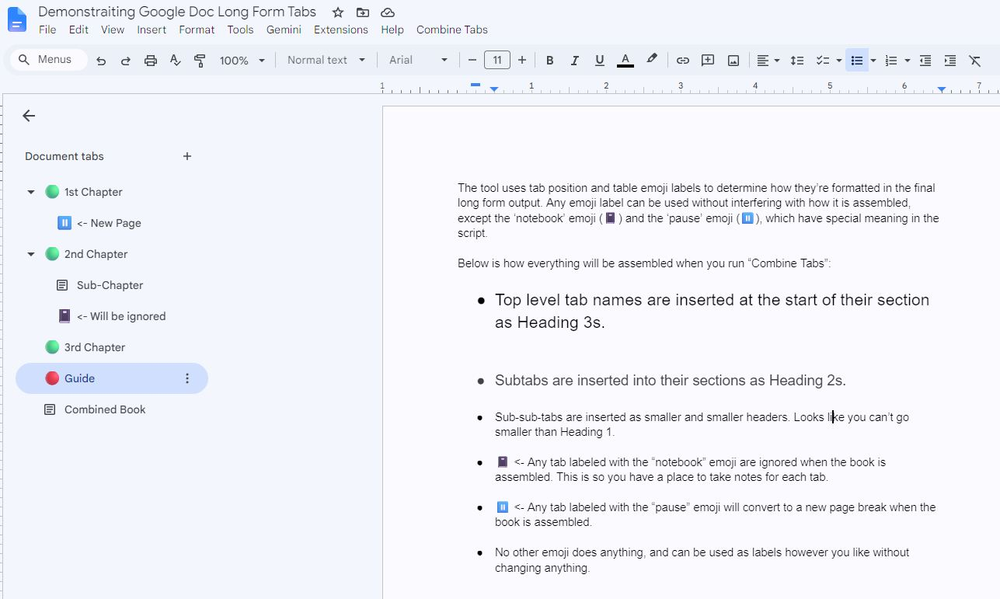
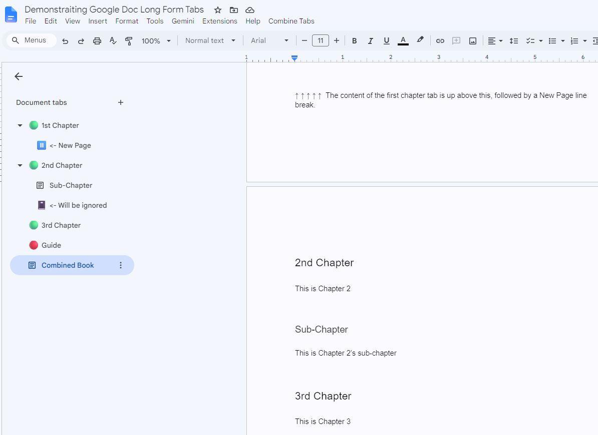

# Combine Google Docs Tabs

Google Docs has tab support that allows you to write chapters or longer-form content, and then drag to rearrange those as you like. This mimics other well known dedicated writing program like Scrivner and Obsidian Long Form, and is very helpful for working on documents where rearranging sections is helpful.

However, you can't export it as a single document for some dumb reason, and it's weird.

They do not include the ability to simply save the entire thing as one continuous-flow document, will all the tabs assembled together sequentially. The best you can do is export all the tabs as PDF and it will do so - but it will also insert a badly formatted page with the name of the tabs at each break in the final output. So then you have to manually delete the inserted pages.

If you wanted to use Google Doc to write a book with one tab per chapter, there's no way to simply export the entire thing into a form at the end that you can print and hand to someone. You'd have to go through and manually move the content of each tab into one tab for printing.

This is a Google Apps Script that assembles all the tabs of a Google Doc — including nested subtabs — into a single tab you can print or export as one continuous document. This allows you to write with tabs to segment sections, arrange them however you like, and then nondestructively compile it into a single tab for printing, exporting, or sharing. 

Google Docs lets you split a document into tabs and subtabs, which is great for drafting a book or long manuscript section by section. The problem: printing and PDF export operate on one tab at a time, and there's no built-in way to merge tabs into a single flow without losing structure. This script does exactly that, rebuilding a dedicated "output" tab from all your other tabs on demand.

## What it does

- Gathers all your tabs, in order, into one tab you can print or save as a single PDF.
- Turns each tab's name into a heading, so the finished document has a tidy structure and outline. Subtabs become smaller headings automatically.
- Keeps your formatting: bold, italics, underlines, links, lists, tables, images, and footnotes all come along.
- Lets you mark certain tabs (with an emoji) to leave them out, or to force a page break — handy for notes tabs or chapter breaks.
- Can be run again any time. It rebuilds the combined tab from scratch, so it always matches your latest edits.

You don't need to know how to code to use this. Just follow the steps below once, and from then on it's a single click from a menu.

## Guide

## Result

## Setup (about 5 minutes, one time)

You'll do this once per document. It's just copy, paste, should work.

**1. Make the tab that will hold the finished version.**
In your document, add a tab and name it exactly **Combined Book**. This is where your assembled document will appear.

**2. Open the script editor.**
At the top of your document, click **Extensions → Apps Script**. A new browser tab opens with a code editor.

**3. Paste in the script.**
In that editor, delete everything in the editor box, if it's not customized. Then open the [`CombineTabs.gs`](CombineTabs.gs) file from this project, copy all of it, and paste it in. You shouldn't have to change anything in the script. Click the **Save** icon (the floppy disk). 

**4. Turn on API support for the emoji formatting to work.**
On the left side of the script editor there's a small menu with a heading called **Services**. Click the **+** next to it. In the list that appears, find and click **Google Docs API**, then click **Add**. (This lets the script handle footnotes and emoji markers.)

**5. Go back and find the new menu.**
Return to your document's browser tab and refresh the page. After a few seconds, a new menu called **Combine Tabs** appears at the top, next to Help.

**6. Run it for the first time.**
Click **Combine Tabs → Rebuild Combined Book**. Google will ask you to give the script permission — this is normal.

### About the permission warning

The first time you run it, Google shows some warning screens because this is a personal script rather than an app from the store. This is expected and safe — the script only ever works inside your own document and on your own account. Here's how to get through it:

1. Click **Review permissions** and choose your Google account.
2. You'll likely see a screen saying **"Google hasn't verified this app."** Click the small **Advanced** link, then click **Go to (project name) (unsafe)**. ("Unsafe" just means Google hasn't personally reviewed it — nothing is sent anywhere.)
3. Click **Allow**.

You only have to do this once.

That's it. Longer documents can take a minute or two, but it'll get there eventually. Your combined document appears in the "Combined Book" tab. Running it again will wipe out the Combined Book tab, and fill it again from scratch.

## WARNING!!!
The 'Combined Book' tab is intended to be a temporary holding place for the output. It will be deleted and rewritten from scratch by the content in the indivdiual tabs every time it's run. DO NOT MAKE ANY EDITS THERE.

Make edits in the original tabs, and then re-combine to update the Combined Book tab.

## How to use it day to day

- **Combine Tabs → Rebuild Combined Book** — rebuilds the combined tab from all your other tabs. Run it whenever you've made changes and want a fresh copy.
- To print or share the result, open the **Combined Book** tab and use **File → Print**, or **File → Download → PDF Document**.

### Leaving tabs out, or adding page breaks

You can control how a tab is treated just by giving it an emoji icon — no code needed. Right-click a tab (or use its three-dot menu) and add an emoji:

- **📓 (notebook)** — leaves that tab out of the combined document. Perfect for keeping research or notes tabs next to your manuscript without them ending up in the final book.
- **⏸️ (pause)** — turns that tab into a page break. The tab's own contents are ignored; it just forces whatever comes next onto a new page. Drag it wherever you want a break.

## Optional: changing the defaults

If you'd like to adjust things — for example, use a different tab name, a different emoji, or more space between sections — open the script in **Extensions → Apps Script**. Everything you can change is grouped at the very top under **CONFIG**, and each setting has a plain-English note explaining it. A few of the handy ones:

| Setting | What it controls |
| --- | --- |
| `TARGET_TAB_TITLE` | The name of the tab that holds the finished version (default "Combined Book"). |
| `SKIP_EMOJIS` | Which emoji marks a tab to leave out (default 📓). |
| `PAGEBREAK_EMOJIS` | Which emoji marks a page break (default ⏸️). |
| `ADD_FOOTNOTES` | Whether footnotes are included. |
| `COPY_HEADER_FOOTER` | Whether the header/footer is carried over. |

If you ever change an emoji and it doesn't seem to work, run **Combine Tabs → Log tab emojis (debug)**, which lists each tab and the exact emoji it's using so you can match it.

## Good to know

- Your original tabs are never changed — the script only writes to the "Combined Book" tab, and rebuilds it each time.
- **Comments** on the document aren't carried over.
- **Headers and footers** can only have one style across the whole combined tab, so the first included tab's header/footer is used throughout.
- **Footnotes** keep bold, italics, underline, and links, but not their font or color.
- Extremely long documents (hundreds of footnotes) can occasionally hit Google's time limit for a single run; if that happens, it'll simply tell you.

## License

MIT — free to use, change, and share.
